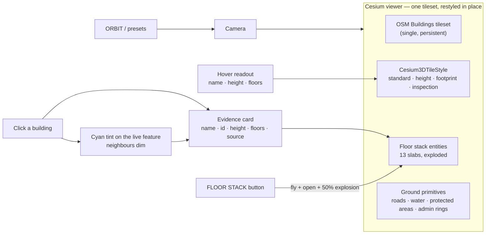
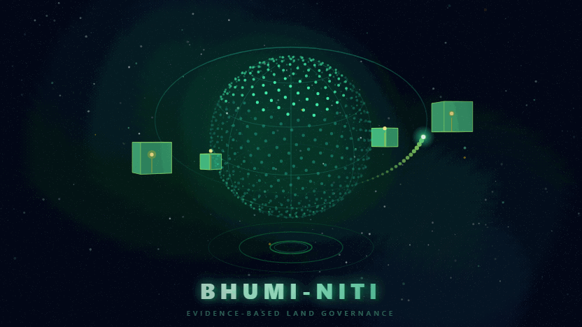
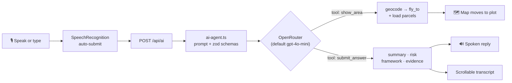
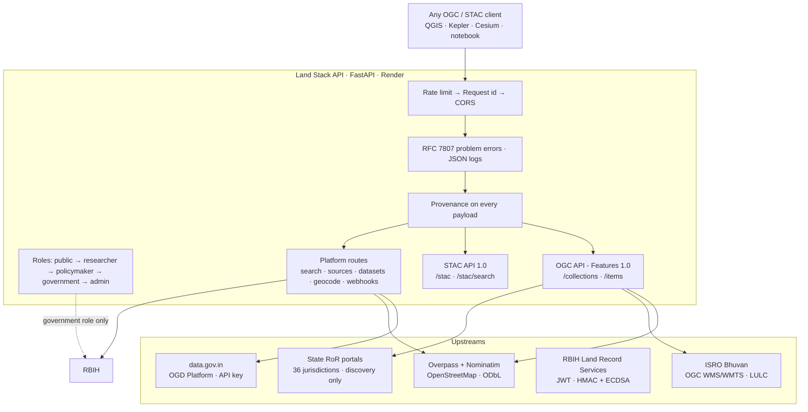
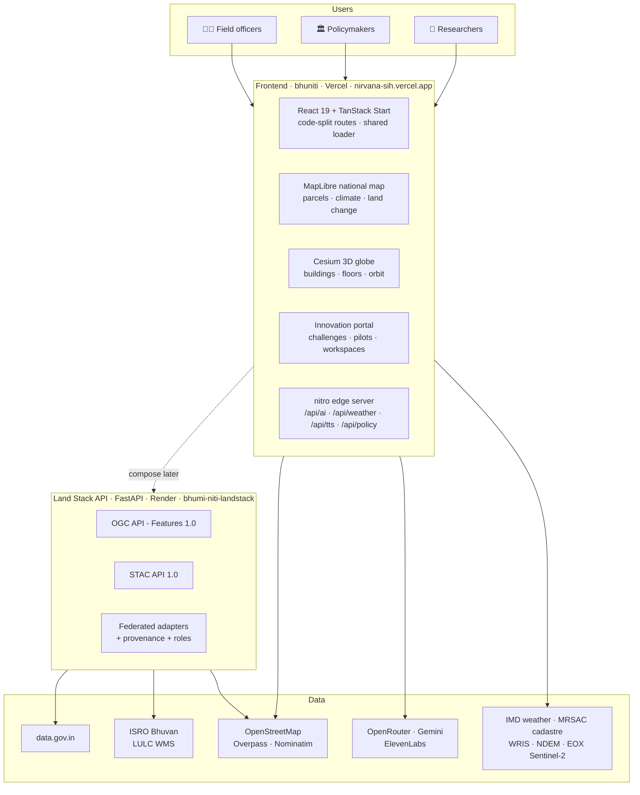
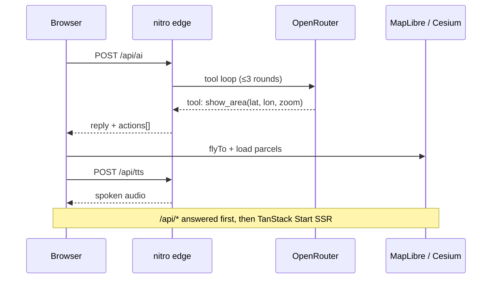

<div align="center">


# भूमि-नीति · BHUMI-NITI

**National Platform for Research & Policy Innovation in Land Governance**

_Land · Data · Policy · India — a map-first workspace for cadastral parcels, disputes,
climate risk, applied research and a **voice-first AI land analyst**._

<br />


<br />

[](https://nirvana-sih.vercel.app)
[](https://bhumi-niti-landstack.onrender.com/health?probe=false)


<br />

**[Overview](#overview)** · **[Features](#features)** · **[3D GIS](#3d-gis-explorer--gis-explorer-3d)** ·
**[Screenshots](#screenshots)** · **[Ask Bhumi](#ask-bhumi--voice-first-ai-agent)** ·
**[Land Stack API](#-land-stack-api--integration-gateway)** · **[Architecture](#architecture)** ·
**[Quick Start](#quick-start)** · **[API](#api-reference)** · **[Deployment](#deployment)**

</div>

---

<a id="overview"></a>

## 🌍 Overview

Bhumi-Niti unifies the land-governance stack into a single research-grade web platform,
plus a **separate integration gateway** that speaks the open geospatial standards to
government and satellite data sources.

### Frontend — [`bhuniti`](.) (this repo) · deployed on Vercel

- **🗺️ A live parcel map** — click anywhere to reverse-geocode the point and inspect
  survey number, area and land use, backed by a three-tier data pipeline
  (cadastral API → bundled OSM demo extract → live Overpass), plus **real MRSAC
  cadastral vector tiles** drawn straight onto the map with a provenance card.
- **🌐 3D GIS Explorer** (`/gis-explorer-3d`) — a full **CesiumJS** globe for India:
  single OSM Buildings tileset restyled on the GPU into four visual modes, camera
  presets, a 360° turntable, hover/click inspection, an evidence card, and a
  **floor-separation stack** for the Patna demo fixture.
- **🎙️ Ask Bhumi** — speak or type a question; an OpenRouter tool-loop agent answers with
  a structured risk/framework/evidence card, **reads it aloud**, and **flies the map to the
  place you asked about**.
- **🧪 Innovation Portal** — a full `/innovation` suite (challenges, pilots, impact,
  submissions, project workspaces) with an evidence-first AI assistant that
  **drops hallucinated citations in code**.
- **📊 Product surfaces** — dashboard, GIS explorer, record-vs-reality,
  land-difference, policy lab, research hub, collaborative hub, workflow and the
  AI map home.

### Backend — [`landstack-api`](https://github.com/OmkarKudalkar23/landstack-api) (separate repo) · deployed on Render

- **🌍 OGC API - Features 1.0** and **STAC API 1.0** over Indian land evidence.
- **🔌 Federated adapters** for data.gov.in, ISRO Bhuvan, OpenStreetMap Overpass,
  Nominatim, the RBIH Land Record Services interface, and a 36-jurisdiction
  Record-of-Rights discovery index.
- **🔐 Role-based access** (public → researcher → policymaker → government → admin)
  with API keys, rate limiting and RFC 7807 errors.
- **🧾 A provenance envelope on every payload** — source, provider, licence and an
  evidence grade (`OBSERVED` / `DERIVED` / `MODELLED` / `SCENARIO` / `DEMO`).

> The two repositories are **independent deployments**. The frontend does not call the
> gateway yet; they are built to be composed later. See
> [Composition](#how-the-two-repositories-fit-together).

Built as a serious prototype for evidence-based land policy — **not** an official record system.

---

<a id="features"></a>

## ✨ Features

<table>
<tr>
<td width="50%">

### 🗣️ Ask Bhumi — voice-first AI

Browser speech-to-text with **auto-submit on silence**, an OpenRouter agent with
`show_area` / `submit_answer` tools, spoken replies via the Web Speech API, and a
scrollable chat transcript that pins to the newest turn.

</td>
<td width="50%">

### 🌐 3D globe with real OSM buildings

CesiumJS renders the OSM Buildings tileset and **restyles it in place** across
four modes (standard / height / footprint / inspection). No second tileset, no
rebuild on toggle — the layer switch only flips `tileset.show`.

</td>
</tr>
<tr>
<td width="50%">

### 🎥 Camera presets + 360° orbit

NORTH, TOP, 45°, ISO, ±45° steps and a true turntable orbit, with a live
heading/pitch readout. The globe keeps working at national scale and at plot scale.

</td>
<td width="50%">

### 🏢 Storeys on every building

A single `buildingFloors` service derives a floor count for **every** building:
the real `building:levels` tag when OSM carries it, otherwise derived from the
measured height at a documented 3.2 m storey, otherwise a clearly labelled
modelled stand-in. Hover and the evidence card both show the basis.

</td>
</tr>
<tr>
<td width="50%">

### 🧱 Floor separation stack

The `FLOOR STACK` shortcut flies to the Patna fixture, opens a 13-slab
exploded view with an explosion slider and per-floor pills — and says plainly
that it is a **demo model, not a survey**.

</td>
<td width="50%">

### 🏷️ Evidence provenance everywhere

Every dataset, KPI, building and AI claim carries an **evidence class**
(observed / derived / modelled / synthetic) and a reliability badge, with an
explicit "Not publicly available" state instead of invented values.

</td>
</tr>
<tr>
<td width="50%">

### 🗺️ Real cadastral + WRIS/NDEM layers

State-aware **MRSAC cadastral vector tiles** (per-state `tiles.json` →
`vector_layers` ids), plus WRIS rivers/waterbodies and NDEM flood-extent
overlays — each with license, coverage and "not a forecast" honesty chips.

</td>
<td width="50%">

### 🌦️ IMD live weather + climate timeline

43 live IMD stations with a Temperature / Rainfall toggle, intensity legend,
and year-scrubbing (2018 → 2024) over Sentinel-2 cloudless mosaics.

</td>
</tr>
</table>

---

<a id="3d-gis-explorer--gis-explorer-3d"></a>

## 🌐 3D GIS Explorer — `/gis-explorer-3d`

A CesiumJS globe scoped to India, built on one persistent OSM Buildings tileset.



**Design constraints held throughout**

| Constraint | How it is respected |
| --- | --- |
| One tileset, never rebuilt | Layer toggle only flips `tileset.show`; style changes mutate `tileset.style` |
| No fabricated geometry | Floor counts are labelled by basis; the stack is a declared demo fixture |
| No silent partial answers | A truncated upstream extract carries a `provenance` warning |
| Cesium stays out of the SSR bundle | The globe is dynamically imported behind an SSR guard |

**What the tileset does *not* have:** Ion's OSM Buildings ships no per-feature
properties, so per-building colour banding is not possible. The globe therefore uses
a deliberate colour per mode and puts per-building detail in the hover readout and
evidence card, where it is real.

---

<a id="screenshots"></a>

## 📸 Screenshots

<p align="center">
  
  <br />
  <sub><b>BHU-NITI in motion</b> — land records, satellite truth and policy evidence orbiting one digital-twin Earth.</sub>
</p>

<p align="center">
  
  <br />
  <sub><b>Live map home</b> — opens on Vashi, Mumbai metro at zoom 13 where MRSAC cadastral parcels are dense; click a polygon for its provenance card.</sub>
</p>

<p align="center">
  
  <br />
  <sub><b>Ask Bhumi assistant</b> — scrollable query transcript, risk meter, regulatory framework, verified sources and follow-up chips.</sub>
</p>

<p align="center">
  
  <br />
  <sub><b>Dashboard · Climate Risk</b> — live IMD rainfall heat layer over Sentinel-2 imagery with the animated risk timeline.</sub>
</p>

---

<a id="ask-bhumi--voice-first-ai-agent"></a>

## 🗣️ Ask Bhumi — Voice-First AI Agent

The `/` route is a working agent, not a chat widget:

1. **Listen** — `SpeechRecognition` fills the composer live; when the utterance closes
   (silence gap or mic re-tap) the query **submits itself**.
2. **Reason** — `POST /api/ai` runs an OpenRouter tool loop (≤ 3 rounds) with zod-validated
   tool calls and a system prompt grounded in Indian land-policy context.
3. **Act** — the `show_area` tool returns a `fly_to` action: the client geocodes the place,
   animates the map and loads plots. `submit_answer` returns the structured card.
4. **Speak** — the `spoken` field is narrated via `speechSynthesis`.



---

<a id="-land-stack-api--integration-gateway"></a>

## 🔌 Land Stack API — Integration Gateway

> **Separate repository:** [`github.com/OmkarKudalkar23/landstack-api`](https://github.com/OmkarKudalkar23/landstack-api)
> · **Live:** `https://bhumi-niti-landstack.onrender.com` · **Docs:** `/docs`

This is PS point 18 — *"APIs for seamless integration with existing government
platforms, research databases, GIS systems, and digital governance initiatives"* —
implemented as a **FastAPI** service that federates land data behind two open
geospatial standards.



**What it deliberately does not do**

| Not built | Why |
| --- | --- |
| State Bhulekh scrapers | Captcha-walled, legally exposed, personal data, brittle |
| PostGIS database | No requirement at this scale; adds a failure mode to a gateway |
| Vector features from Bhuvan | Bhuvan WMS is raster — fabricating features would be a correctness lie |
| OAuth2 issuance | This service is a **resource server**, not an identity provider |

**Research that shaped it** — including the DILRMP 3.0 mandate for a
"Federated Secure API-Architecture based Land Stack" with ULPIN as the common parcel
identifier, and the finding that **no State or UT publishes an official public API for
Records of Rights** — lives in that repo's `docs/RESEARCH.md`.

---

<a id="architecture"></a>

## 🏗️ Architecture

### The whole system



### Request flow on the frontend edge



Every `/api/*` handler is framework-agnostic `Request → Response`, so the same code
runs on `vite dev` and on the deployed build.

### Why the frontend is code-split

Routes are lazily loaded behind a single Suspense boundary, so opening one screen
does not download the whole app. The shared loader is shown while a chunk is in
flight.

| Route | Chunk cost avoided |
| --- | --- |
| `/policy-lab` | 303 kB |
| `/workflow` | 100 kB |
| `/` (map home) | 60 kB |
| `/gis-explorer-3d` | 183 kB of Cesium-free glue, globe itself dynamic |

---

<a id="how-the-two-repositories-fit-together"></a>

## 🔗 How the two repositories fit together

| | [`bhuniti`](.) | [`landstack-api`](https://github.com/OmkarKudalkar23/landstack-api) |
| --- | --- | --- |
| Language | TypeScript / React | Python / FastAPI |
| Runtime | Vercel (nitro → Node) | Render (uvicorn) |
| Role | User-facing platform | Integration gateway |
| Standards | — | OGC API - Features 1.0, STAC API 1.0 |
| Repo | this one | separate GitHub repo |

**Today they are independent.** The gateway is deployed and documented, and the
frontend is deployed and documented. They are designed to compose — the gateway
exposes exactly the collections the globe and map consume — but no frontend call
has been wired yet. When it is, the composition is a service URL plus an
`X-API-Key` header, not a refactor.

---

<a id="tech-stack"></a>

## 🛠 Tech Stack

### Frontend

| Layer | Choices |
| --- | --- |
| **Framework** | React 19, TanStack Start / Router (lazy routes), React Query 5 |
| **Build & runtime** | Vite 8, nitro (Vercel preset), TypeScript 5.8 (strict) |
| **Styling** | Tailwind CSS 4, Radix UI, CVA + tailwind-merge, tw-animate-css |
| **Mapping** | MapLibre GL 6, **CesiumJS 1.145** for the 3D globe |
| **Charts & forms** | Recharts, react-hook-form + zod, lucide-react |
| **AI & voice** | OpenRouter, Google Gemini, ElevenLabs, Web Speech API (STT/TTS) |
| **Quality** | ESLint 9, Prettier, `tsc --noEmit`, headless-Chrome E2E suites |

### Backend

| Layer | Choices |
| --- | --- |
| **Framework** | FastAPI 0.121, Pydantic 2, pydantic-settings |
| **Runtime** | Uvicorn on Render, Python 3.13, single instance |
| **Standards** | OGC API - Features 1.0, STAC API 1.0, GeoJSON RFC 7946, RFC 7807 |
| **Resilience** | Shared async HTTP client: retries, jittered backoff, 12 MB cap, TTL + LRU cache |
| **Security** | API keys with ordered roles, sliding-window rate limiting, CORS allowlist |
| **Quality** | pytest (67 tests, no network), live smoke suite (23 checks) |

---

<a id="quick-start"></a>

## 🚀 Quick Start

### Frontend

**Prerequisites** — [Node.js](https://nodejs.org) **20.19+** and npm.

```sh
git clone https://github.com/OmkarKudalkar23/bhuniti.git
cd bhuniti
npm install

cp .env.example .env
#   → OPENROUTER_API_KEY (Ask Bhumi + innovation assistant)
#   → ELEVENLABS_API_KEY  (server-side voice; optional)
#   → GEMINI_API_KEY      (Policy Lab PDF reader; optional)

npm run dev        # → http://localhost:8080
```

The app runs without the AI key — the agent endpoint returns a graceful `503` and
everything else (map, parcels, weather, globe, dashboard) works in demo mode.

| Command | What it does |
| --- | --- |
| `npm run dev` | Dev server with SSR + `/api/*` → `http://localhost:8080` |
| `npm run build` | Production build (client + SSR + nitro) |
| `npm run preview` | Preview the production build locally |
| `npm run lint` | ESLint over the repo |
| `npm run format` | Prettier write |
| `npm run typecheck` | strict `tsc --noEmit` |

### Backend

```sh
git clone https://github.com/OmkarKudalkar23/landstack-api.git
cd landstack-api
python -m venv .venv && .venv\Scripts\activate     # or: source .venv/bin/activate
pip install -r requirements.txt
cp .env.example .env                                  # Windows: copy .env.example .env
uvicorn app.main:app --reload                         # → http://localhost:8000/docs

pytest -q                                              # 67 tests, no network needed
```

---

<a id="environment"></a>

## 🔐 Environment Variables

`.env` is **git-ignored**; `.env.example` documents every key.

### Frontend

| Variable | Scope | Default | Purpose |
| --- | --- | --- | --- |
| `OPENROUTER_API_KEY` | Server only | — | Powers `POST /api/ai` and `POST /api/innovation/ai` |
| `OPENROUTER_MODEL` | Server only | `openai/gpt-4o-mini` | Chat model for the agent loop |
| `ELEVENLABS_API_KEY` | Server only | — | Powers `POST /api/tts` |
| `GEMINI_API_KEY` | Server only | — | Powers `POST /api/policy/extract` |
| `VITE_DEMO_MODE` | Client | `true` | Prefers the bundled OSM extract; degrades offline |
| `VITE_SENTINEL_YEAR` | Client | `2024` | Sentinel-2 mosaic year |
| `VITE_PARCEL_API_URL` | Client | _(own API)_ | Optional PostGIS parcel service |

### Backend

| Variable | Default | Purpose |
| --- | --- | --- |
| `PUBLIC_BASE_URL` | `http://localhost:8000` | Builds self/next links |
| `CORS_ORIGINS` | `*` | Comma separated. Wildcard ignored in production |
| `API_KEYS_JSON` | `""` | JSON array of `{key, role, label}`. Empty = open |
| `REQUIRE_API_KEY` | `false` | Force a key even when none are configured |
| `RATE_LIMIT_PER_MINUTE` | `60` | Per key, or per IP when open |
| `DATA_GOV_IN_API_KEY` | `""` | 32-char hex from data.gov.in; without it that source reports `unconfigured` |
| `OVERPASS_URL` / `OVERPASS_MIRRORS` | overpass-api.de + kumi | First is tried, rest are fallbacks |
| `RBIH_CLIENT_ID` / `RBIH_CLIENT_SECRET` | `""` | Institutional onboarding required |
| `USER_AGENT` | see `.env.example` | **Set a real contact** — OSM requires this |

The service starts with any of these unset. A source that needs a credential reports
`unconfigured` with an actionable reason instead of failing requests.

---

<a id="api-reference"></a>

## 🌐 API Reference

### Frontend (this repo)

| Method | Endpoint | Description |
| --- | --- | --- |
| `GET` | `/api/parcels?bbox=w,s,e,n` | Cadastral features for a bbox. Filters: `village`, `surveyNumber`, `parcelId` |
| `GET` | `/api/weather/stations` | All live IMD stations (43) with temperature & rainfall |
| `GET` | `/api/weather/station?id=…` | Single station reading |
| `GET` | `/api/weather/summary` | National rainfall summary |
| `POST` | `/api/ai` | Land-intelligence agent — tool loop, structured reply, spoken text, map actions |
| `POST` | `/api/innovation/ai` | Evidence assistant — 8 tools; **every citation validated, hallucinated refs dropped** |
| `POST` | `/api/tts` | ElevenLabs speech for Ask Bhumi replies |
| `POST` | `/api/policy/extract` | Gemini PDF reader → structured, quoted policy parameters |

<details>
<summary><b>POST /api/ai — example</b></summary>

```sh
curl -X POST http://localhost:8080/api/ai \
  -H "Content-Type: application/json" \
  -d '{"message":"Show me the plots in Nashik"}'
```

```json
{
  "ok": true,
  "model": "openai/gpt-4o-mini",
  "reply": {
    "summary": "The map now displays the land plots in Nashik.",
    "framework": ["Zoning & Land Use: …"],
    "riskAssessment": "Low risk …",
    "evidence": [{ "label": "MahaBhumi Records", "type": "Government" }],
    "limitation": "…",
    "suggestedFollowups": ["What are the zoning regulations for this area?"]
  },
  "spoken": "I've zoomed into Nashik to show you the land plots in the area.",
  "actions": [{ "type": "fly_to", "place": "Nashik", "lat": 19.9975, "lon": 73.7898, "zoom": 13 }]
}
```

</details>

### Backend — Land Stack API

| Method | Endpoint | Description |
| --- | --- | --- |
| `GET` | `/` | Landing page / OGC service description |
| `GET` | `/conformance` | OGC API - Features conformance classes |
| `GET` | `/conformance/stac` | STAC conformance classes |
| `GET` | `/collections` | All collections with licence, evidence grade, extent |
| `GET` | `/collections/{id}` | One collection described |
| `GET` | `/collections/{id}/items?bbox=…` | Features for a bbox (GeoJSON) |
| `GET` | `/stac` · `/stac/collections` | STAC catalog and collections |
| `GET` | `/stac/search?collections=…&bbox=…` | Cross-collection item search |
| `GET` | `/api/v1/sources` | Every upstream with auth requirements and limitations |
| `GET` | `/api/v1/sources/health` | Live per-source health |
| `GET` | `/api/v1/search?q=…&kind=place\|state` | Federated search |
| `GET` | `/api/v1/datasets/{id}/records` | data.gov.in record proxy |
| `GET` | `/api/v1/bhuvan/capabilities` · `/getmap` | Bhuvan WMS catalogue and GetMap URL |
| `GET` | `/api/v1/geocode` · `/geocode/reverse` | Nominatim geocoding |
| `GET` | `/api/v1/land-records/index` · `/states/{s}` | State RoR discovery index |
| `POST` | `/api/v1/land-records/rbih/owner-details` | **Government role only** · personal data |
| `GET`/`POST` | `/api/v1/webhooks` | Event subscriptions |
| `GET` | `/health` · `/health?probe=false` · `/ready` | Full probe, fast probe, liveness |

---

<a id="project-structure"></a>

## 📁 Project Structure

```text
bhuniti/                              # this repo — frontend (Vercel)
├── public/                           # logo, static assets
├── docs/screenshots/                 # README imagery
├── src/
│   ├── routes/                       # 19 lazy routes (/  /dashboard  /gis-explorer-3d  /innovation/* …)
│   ├── components/
│   │   ├── home/                     # MapFirstHome — live map + Ask Bhumi composer
│   │   ├── dashboard/                # IndiaMap, timeline, choropleth, panels
│   │   ├── gis3d/                    # 3D explorer
│   │   │   ├── GisExplorer3D.tsx     # orchestrator — toolrow, panels, effects
│   │   │   ├── globe/CesiumGlobe.ts  # the single Cesium viewer, restyle + pick + floor stack
│   │   │   ├── GisFloorStack.tsx     # floor separation stack card
│   │   │   ├── GisIntelPanel.tsx     # evidence card
│   │   │   ├── layerRegistry.ts      # 38 layer definitions
│   │   │   └── demoBuilding.ts       # Patna demo fixture (declared MODELLED)
│   │   ├── innovation/  ui/  land-difference/  record-reality/
│   │   ├── policy-lab/  research-hub/  workflow/
│   ├── server/
│   │   ├── ai-agent.ts               # OpenRouter tool loop
│   │   ├── innovation-ai.ts          # citation-verified tool loop
│   │   ├── parcel-store.ts           # bbox cadastral API
│   │   ├── tts.ts  policy-extract.ts  weather-india.ts
│   ├── services/
│   │   ├── gis3d/                    # osmVectors (Overpass) · buildingFloors · parcels · adminGeo
│   │   ├── cadastre.ts  parcelService.ts  geocode  weather  sentinel
│   ├── data/                         # data-sources registry, imd-stations, innovation fixtures
│   └── styles.css                    # design tokens + component styles
├── vite.config.ts                    # dev wiring → src/server.ts, Vercel preset
├── vercel.json                       # deployment config
└── package.json

landstack-api/                        # separate repo — backend (Render)
├── app/
│   ├── core/                         # config · RFC 7807 errors · JSON logging · provenance
│   ├── security/                     # API keys + ordered roles · rate limiting
│   ├── services/                     # async HTTP client · TTL + LRU cache
│   ├── adapters/                     # data_gov_in · bhuvan · overpass · nominatim · rbih · state_bhulekh
│   ├── api/                          # root · collections · v1 (ogc, stac, platform, integration, webhooks)
│   └── data/                         # collections.json · sources.json · layers.json · state_portals.json
├── tests/                            # 67 pytest tests, no network
├── docs/RESEARCH.md                  # the integration research
├── render.yaml                       # Render blueprint
└── requirements.txt
```

---

<a id="data-sources"></a>

## 📡 Data Sources & Disclaimers

| Source | Used for | Access |
| --- | --- | --- |
| **IMD** (India Meteorological Dept.) | Live station weather, rainfall heat layer | Server proxy, 43 stations |
| **MRSAC / Datameet cadastre** | Real cadastral polygons (state-wise vector tiles) | `src/services/cadastre.ts`, CC0 |
| **WRIS** (Water Resources Info System) | Rivers & waterbodies overlays | Vector tiles, CC0 via Datameet |
| **NDEM** | Historical flood inundation 1998–2022 | Vector tiles — _observed extent, not a forecast_ |
| **OpenStreetMap** | 3D buildings, roads, water, boundaries (Overpass), geocoding (Nominatim) | Keyless, rate-limited, ODbL |
| **ISRO Bhuvan** | LULC thematic layers, 3D building tileset | OGC WMS/WMTS; Ion token for buildings |
| **EOX / Copernicus** | Sentinel-2 cloudless mosaics (2018 · 2020 · 2024) | Tile service |
| **data.gov.in** | Tabular datasets by resource id | API key (gateway) |
| **RBIH LRS** | Records of Rights (9 states) | Institutional onboarding; personal data |
| **Bundled cadastral extracts** | Demo parcels (Gujarat corridor) | In-repo JSON |

> ⚠️ **Prototype data shown for demonstration.** Nothing here substitutes for official
> MahaBhumi / Bhu-Naksha records, Tahsildar offices or court documents. Cadastral tiles
> are labelled `REAL CADASTRAL POLYGON` with provider/upstream/license rows; OSM polygons
> are explicitly **not** cadastre; missing fields read "Not publicly available / not
> connected". The 3D floor stack is a **declared demo fixture**, not a survey. The AI
> assistant states its evidence and limitations on every answer.

---

<a id="deployment"></a>

## ☁️ Deployment

### Frontend → Vercel

- **Live:** [`https://nirvana-sih.vercel.app`](https://nirvana-sih.vercel.app)
- `vercel.json` + `vite.config.ts` select the **Vercel** nitro preset
  (Cloudflare is kept only inside a Lovable sandbox build).
- `npm run build` emits `.vercel/output/`; Vercel auto-detects the
  functions + static split.
- Secrets are set in the Vercel project (`.env` is never committed):
  `OPENROUTER_API_KEY`, `OPENROUTER_MODEL`, `ELEVENLABS_API_KEY`, `ELEVENLABS_VOICE_ID`.
- If the domain is behind Vercel Authentication, turn it off under
  **Settings → Deployment Protection** for it to be publicly reachable.

### Backend → Render

- **Live:** `https://bhumi-niti-landstack.onrender.com` (`/docs` for Swagger UI)
- Deployed as a **Blueprint** from `render.yaml`; health check is `/ready`.
- Health probe: `/health` (full, ~25 s because ISRO is slow from outside India) or
  `/health?probe=false` (**<1 s**, for uptime monitoring).
- Free plan sleeps on inactivity and cold-starts on first request (~30 s).

---

<a id="quality"></a>

## ✅ Quality Gates

```sh
# Frontend
npm run lint && npm run format && npm run typecheck && npm run build

# Backend
pytest -q
```

Both are verified with headless Chrome end-to-end suites: the 3D globe boots and
renders buildings, mode switches and layer toggles work, floor stacks open exploded
with correct slab ordering, selection tinting survives a mode change, tooltips carry
floor counts, and every route renders with **zero page errors**.

---

<a id="roadmap"></a>

## 🗺️ Roadmap

- 🔗 **Compose the two services** — wire the gateway's OGC/STAC collections into the
  globe and map behind a service URL + API key
- 🏛️ **State open-data adapters** — parcel boundaries from portals that publish
  WMS/GeoJSON without a captcha
- 📊 **Bhuvan thematic statistics** — turn the raster service into queryable aggregates
- 🧩 **Pluggable policy tools** — land-records lookups as additional agent tools
- 🌏 **Multilingual voice** — regional-language STT/TTS for field use
- 🛰️ **Change alerts** — scheduled Sentinel-2 diff over watched parcels

---

<a id="development-with-lovable"></a>

## 🔗 Development with Lovable

This project was built with [Lovable](https://lovable.dev).

Continue developing in the [Lovable editor](https://lovable.dev/projects/b07fc0a7-84e0-425d-a58c-6555e94bf0af).

- **Ship faster** — describe what to build; Lovable handles the code.
- **Stay in sync** — changes made in Lovable are committed straight to this repository.
- **Full ownership** — push to `main` and your changes sync back into Lovable.

---

<div align="center">

**Crafted for land, data & policy in India 🇮🇳**

[](https://nirvana-sih.vercel.app)
[](https://bhumi-niti-landstack.onrender.com/docs)
[](https://nodejs.org)
[](https://github.com/OmkarKudalkar23/bhuniti)


<sub>👋 **Bhumi-Niti** — same land, more clarity, better decisions.</sub>

</div>
