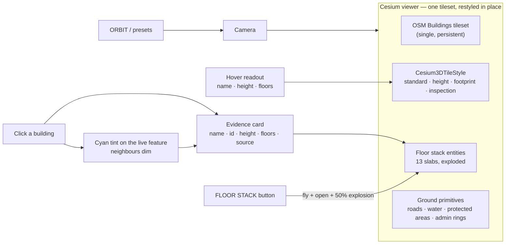
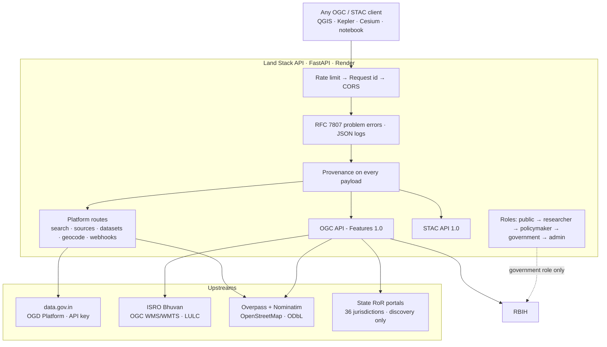
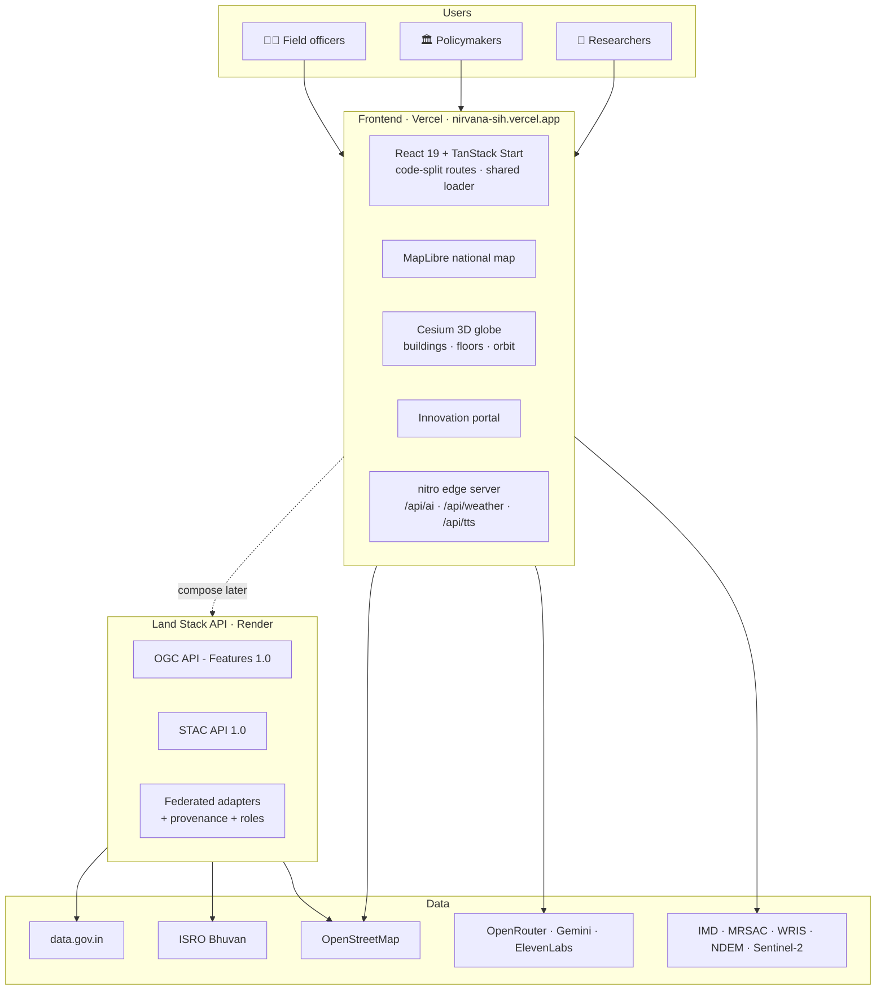
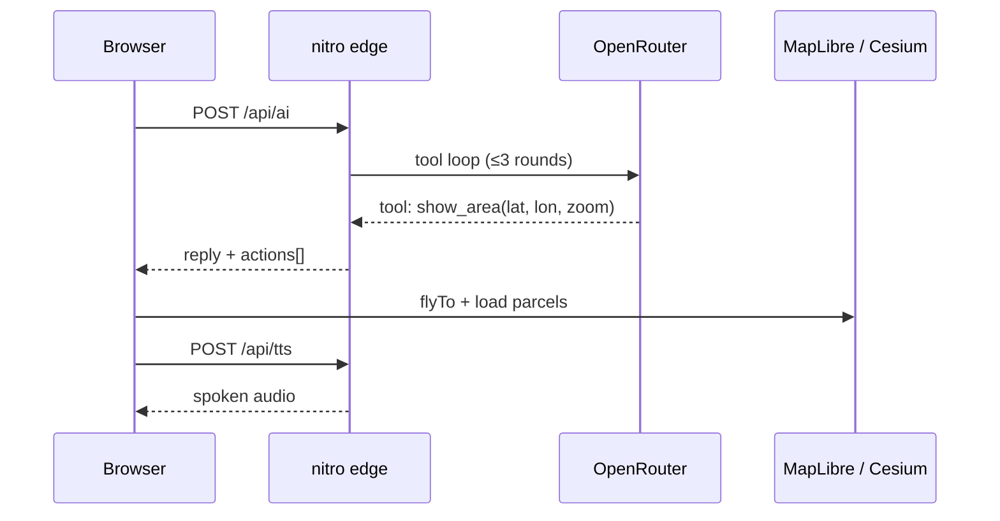

<div align="center">


# निर्वाण · NIRVANA

**National Platform for Research & Policy Innovation in Land Governance**

_Land · Data · Policy · India — a map-first workspace for cadastral parcels, disputes,
climate risk, applied research and a **voice-first AI land analyst**._

<br />


<br />

[](https://nirvana-sih.vercel.app)
[](https://bhumi-niti-landstack.onrender.com/health?probe=false)


<br />

**[Mission](#mission)** · **[Coverage](#requirement-coverage)** · **[Features](#features)** ·
**[3D GIS](#3d-gis-explorer--gis-explorer-3d)** · **[Land Stack API](#-land-stack-api)** ·
**[Architecture](#architecture)** · **[Data](#data-honesty)** · **[Quick Start](#quick-start)** ·
**[API](#api-reference)** · **[Deploy](#deployment)** · **[Roadmap](#roadmap)**

</div>

---

## 🎬 Interactive Architecture

Open the source-backed runtime map — click any node to inspect it, trace paths,
compare the public edge against the federation zone, and export a share card.

**[▶ Open the interactive architecture diagram](docs/architecture/nirvana-architecture.html)**

<p align="center">
  
  <br />
  <sub><b>Two services, one platform.</b> Green pulses are the Vercel experience layer, gold pulses the Render integration gateway, blue the open standards and AI services.</sub>
</p>

**Viewer controls** — `/` focus a node · `PATH` trace a route · `LENS` compare two
roles · `M` overview radar · `F` presentation stage · `T` toggle theme · `E` export.

> **How it is built.** [`tt-a1i/archify`](https://github.com/tt-a1i/archify) —
> typed JSON IR, schema validation, layout-clearance checks and route-label
> collision detection, delivered as one self-contained HTML file. The editable
> source is [`docs/architecture/nirvana.architecture.json`](docs/architecture/nirvana.architecture.json);
> regenerate with `node archify/bin/archify.mjs deliver architecture
> docs/architecture/nirvana.architecture.json docs/architecture/nirvana-architecture.html
> --quality showcase`.

---

<a id="mission"></a>

## 🎯 Mission

Land is a **finite, strategic resource** underpinning economic development,
environmental sustainability, food security, urban expansion and social equity.
Yet India's land-administration ecosystem is largely *implementation-oriented* —
little institutional focus on **applied research, policy experimentation and
evidence-based innovation**.

Nirvana is a **national knowledge ecosystem** where researchers, policymakers,
academies and government agencies meet to collect evidence, run policy experiments
and publish findings — not an official record system.

### The gap we close

| Problem today | What Nirvana does |
| --- | --- |
| Data exists in silos, barely used | A federated API that speaks open standards |
| Research and policy live in separate portals | One repository + collaborative workspaces |
| No way to *test* a policy before announcing it | Policy Lab simulation + scenario modelling |
| Map tools show data without saying how trustworthy it is | Every payload carries source, licence, evidence grade |
| Building footprints are flat, meaningless boxes | 3D buildings with storeys and floor separation |
| Land records are state silos with no public API | A 36-jurisdiction discovery index + the sanctioned RBIH route |

---

<a id="requirement-coverage"></a>

## ✅ Requirement Coverage

Every point of the problem statement, and where it lives:

| # | Requirement | Status | Where |
| --- | --- | --- | --- |
| 1 | National repository for research, policy, datasets, legal docs | ✅ | Innovation Portal + Innovation Home, 16 policy instruments + 10 dataset records + file upload |
| 2 | AI-powered search & recommendation | ✅ | Ask Bhumi agent (`src/server/ai-agent.ts`, 840-line OpenRouter tool loop) |
| 3 | Collaborative workspaces for researchers & agencies | ✅ | `/innovation/workspace/$projectId` |
| 4 | Interactive GIS: land use, climate, infrastructure, policy | ✅ | MapLibre national map + Cesium 3D globe |
| 5 | Advanced analytics & decision support | ✅ | Policy Lab, Land-Difference, climate timeline, 26 indicator series |
| 6 | Policy simulation before implementation | ✅ | `/policy-lab` (evaluate existing / simulate new) |
| 7 | Centralised digital repository | ✅ | Research Hub, Innovation Hub, upload + policy extract |
| 8 | AI search & recommendation engine | ✅ | Ask Bhumi + copilot, validated query plans |
| 9 | Collaborative workspaces | ✅ | Workspace + Copilot screens |
| 10 | Interactive GIS visualisation | ✅ | GIS Explorer 2D + 3D (38 layers, 6 groups) |
| 11 | Advanced analytics & decision support | ✅ | Evidence panels, provenance engine (742 graded citations) |
| 12 | Policy simulation modules | ✅ | Policy Lab |
| 13 | Integration: satellite, land records, socio-economic, geospatial | ✅ | **Land Stack API** federates ISRO, OSM, data.gov.in, RBIH |
| 14 | AI research tools: trend, synthesis, predictive, scenario | ✅ | Copilot + simulation engine, Difference-in-Differences panel |
| 15 | Innovation portal: hackathons, grants, pilots, competitions | ✅ | Challenges → pilots → impact → submit |
| 16 | Dashboards: research, policy KPIs, land use, climate, disputes | ✅ | Dashboard + 3D scenario drawer + Research Hub |
| 17 | Secure role-based access | ✅ | 5-role model (see [Security](#security--privacy)) |
| 18 | **APIs for integration with government/GIS systems** | ✅ | **Land Stack API** — OGC + STAC, see below |

✅ = shipped and reachable in this repo. The platform is a serious prototype;
nothing here substitutes for statutory records, and no requirement is marked
complete on the strength of a mock — a working implementation sits at every ✅.

### Where the honest gaps still are

Ticking the table above describes **features**, not **data coverage**. These
remain deliberately unfinished, and the UI says so at the point of use:

| Gap | Current state |
| --- | --- |
| Live land records | Records of Rights are a **discovery index** (36 State/UT portals) — no parcel-level RoR is fetched, by design |
| RBIH owner details | Implemented and role-gated, but **unconfigured** until institutional credentials exist |
| data.gov.in | Adapter is live but **unconfigured** until a valid API key is added |
| Bhuvan rasters | WMS/WMTS reachable but **slow** from the gateway host — documented layers still render |
| Search ranking | Ask Bhumi retrieves over an LLM tool loop; there is no trained ranking model |
| Predictive models | Difference-in-Differences and scenario models are **modelled**, not validated forecasts |

---

<a id="features"></a>

## ✨ Features

<table>
<tr>
<td width="50%">

### 🗣️ Ask Bhumi — voice-first AI

Speak or type; the query **auto-submits on silence**. An OpenRouter tool-loop agent
answers with a structured risk / framework / evidence card, **narrates the reply**
via the Web Speech API, and **flies the map** to the place you asked about.

</td>
<td width="50%">

### 🌐 3D globe with real OSM buildings

CesiumJS renders the OSM Buildings tileset and **restyles it in place** across four
modes (standard / height / footprint / inspection). One tileset, never rebuilt —
layer toggles only flip `tileset.show`.

</td>
</tr>
<tr>
<td width="50%">

### 🎥 Camera presets + 360° orbit

NORTH, TOP, 45°, ISO, ±45° steps and a true turntable orbit, with a live
heading/pitch readout. Works at national scale and at plot scale.

</td>
<td width="50%">

### 🏢 Storeys on every building

A single `buildingFloors` service derives a floor count for **every** building: the
real `building:levels` tag when OSM carries it, otherwise derived from measured
height at a documented 3.2 m storey, otherwise a clearly labelled modelled stand-in.

</td>
</tr>
<tr>
<td width="50%">

### 🧱 Floor separation stack

The **FLOOR STACK** shortcut flies to the Patna fixture and opens a 13-slab
exploded view with an explosion slider and per-floor pills — and says plainly it is
a **demo model, not a survey**.

</td>
<td width="50%">

### 🗺️ Real cadastral + WRIS/NDEM layers

State-aware **MRSAC cadastral vector tiles**, plus WRIS rivers/waterbodies and
NDEM flood-extent overlays — each with licence, coverage and "not a forecast" chips.

</td>
</tr>
<tr>
<td width="50%">

### 🌦️ IMD live weather + climate timeline

43 live IMD stations with a Temperature / Rainfall toggle, and year-scrubbing
(2018 → 2024) over Sentinel-2 cloudless mosaics.

</td>
<td width="50%">

### 🏷️ Evidence provenance everywhere

Every dataset, KPI, building and AI claim carries an **evidence class** (observed /
derived / modelled / synthetic) and a reliability badge — with an explicit
"Not publicly available" state instead of invented values.

</td>
</tr>
</table>

---

<a id="3d-gis-explorer--gis-explorer-3d"></a>

## 🌐 3D GIS Explorer — `/gis-explorer-3d`



| Constraint | How it is respected |
| --- | --- |
| One tileset, never rebuilt | Layer toggle only flips `tileset.show`; styles mutate `tileset.style` |
| No fabricated geometry | Floor counts labelled by basis; the stack is a declared demo fixture |
| No silent partial answers | A truncated upstream extract carries a `provenance` warning |
| Cesium out of the SSR bundle | Globe dynamically imported behind an SSR guard |

> **What the tileset does _not_ have:** Ion's OSM Buildings ships no per-feature
> properties, so per-building colour banding is impossible. The globe therefore uses
> a deliberate colour per mode and puts per-building detail in the hover readout and
> evidence card, where it is real.

---

<a id="-land-stack-api"></a>

## 🔌 Land Stack API — the integration gateway

> **Repo:** [`github.com/OmkarKudalkar23/landstack-api`](https://github.com/OmkarKudalkar23/landstack-api)
> · **Live:** `https://bhumi-niti-landstack.onrender.com` · **Docs:** `/docs`

This is PS point 18 — *"APIs for seamless integration with existing government
platforms, research databases, GIS systems, and digital governance initiatives"* —
implemented as a **FastAPI** service federating land data behind two open
geospatial standards.



**What it deliberately does not do**

| Not built | Why |
| --- | --- |
| State Bhulekh scrapers | Captcha-walled, legally exposed, personal data, brittle |
| PostGIS database | No requirement at this scale; adds a failure mode to a gateway |
| Vector features from Bhuvan | Bhuvan WMS is raster — fabricating features would be a correctness lie |
| OAuth2 issuance | It is a **resource server**, not an identity provider |

**Research that shaped it** — the DILRMP 3.0 mandate for a *"Federated Secure
API-Architecture based Land Stack"* with ULPIN as the common parcel identifier, and
the finding that **no State or UT publishes an official public API for Records of
Rights** — lives in that repo's `docs/RESEARCH.md`.

---

<a id="architecture"></a>

## 🏗️ Architecture

### The whole system



### Request flow on the edge



### Why the frontend is code-split

Routes load lazily behind a shared Suspense boundary, so opening one screen doesn't
download the whole app.

| Route | Chunk avoided |
| --- | --- |
| `/policy-lab` | 303 kB |
| `/workflow` | 100 kB |
| `/` (map home) | 60 kB |
| `/gis-explorer-3d` | Cesium stays out of the entry chunk |

---

<a id="data-honesty"></a>

## 🧾 Data honesty

Land data is easy to overstate. The platform therefore attaches a **provenance
envelope** to every payload that carries data:

```json
"provenance": {
  "sources": [{
    "id": "overpass",
    "provider": "OpenStreetMap Foundation",
    "license": "Open Database License (ODbL) 1.0",
    "evidence": "OBSERVED"
  }],
  "warnings": []
}
```

| Grade | Meaning |
| --- | --- |
| `OBSERVED` | Measured or published by a primary source |
| `DERIVED` | Computed from observed data by a documented rule |
| `MODELLED` | Produced by a model; carries model assumptions |
| `SCENARIO` | Hypothetical, for exploration only |
| `DEMO` | Placeholder, not real-world data |

- Truncated upstream extracts always carry a **warning**.
- Collections with uneven State coverage declare `x-availability: "limited"`.
- Missing fields read **"Not publicly available"** — never invented.

---

<a id="security--privacy"></a>

## 🔐 Security & privacy

Ordered roles, so authorisation is "at or above" rather than a list of special cases:

| Role | Holder | Capabilities |
| --- | --- | --- |
| `public` | Anonymous | Browsing, OGC/STAC reads, public datasets |
| `researcher` | Universities, research bodies | All public, higher rate limits |
| `policymaker` | Government analysts | Policy corpora, scenario tools |
| `government` | Revenue / registration | **+ RBIH owner details (personal data)** |
| `admin` | Platform operator | Key management, sync triggers |

**The personal-data boundary is a hard line.** Exactly one route can return owner
personal data. It requires the `government` role, is never logged, never cached, and
its response carries a retention warning. Owner data is governed by the **DPDP Act,
2023**.

---

<a id="quick-start"></a>

## 🚀 Quick Start

### Frontend

```sh
git clone https://github.com/vanshpatil16/Bhuniti.git
cd Bhuniti
npm install
cp .env.example .env       # Windows: copy .env.example .env
npm run dev                # → http://localhost:8080
```

| Command | What it does |
| --- | --- |
| `npm run dev` | Dev server with SSR + `/api/*` |
| `npm run build` | Production build (client + SSR + nitro) |
| `npm run preview` | Preview the production build |
| `npm run lint` | ESLint |
| `npm run format` | Prettier write |
| `npm run typecheck` | strict `tsc --noEmit` |

### Backend

```sh
git clone https://github.com/OmkarKudalkar23/landstack-api.git
cd landstack-api
python -m venv .venv && .venv/Scripts/activate   # or: source .venv/bin/activate
pip install -r requirements.txt
cp .env.example .env
uvicorn app.main:app --reload                     # → http://localhost:8000/docs
pytest -q                                          # 67 tests, no network needed
```

---

<a id="api-reference"></a>

## 🌐 API Reference

### Frontend

| Method | Endpoint | Description |
| --- | --- | --- |
| `GET` | `/api/parcels?bbox=w,s,e,n` | Cadastral features for a bbox |
| `GET` | `/api/weather/stations` | All live IMD stations (43) |
| `GET` | `/api/weather/station?id=…` | Single station reading |
| `GET` | `/api/weather/summary` | National rainfall summary |
| `POST` | `/api/ai` | Land-intelligence agent — tool loop, reply, spoken text, map actions |
| `POST` | `/api/innovation/ai` | Evidence assistant — 8 tools; **hallucinated citations dropped** |
| `POST` | `/api/tts` | ElevenLabs speech |
| `POST` | `/api/policy/extract` | Gemini PDF reader → structured policy quotes |

### Land Stack API

| Method | Endpoint | Description |
| --- | --- | --- |
| `GET` | `/` | Landing page / OGC service description |
| `GET` | `/conformance` · `/conformance/stac` | Conformance classes |
| `GET` | `/collections` · `/collections/{id}` | Collections with licence, evidence grade, extent |
| `GET` | `/collections/{id}/items?bbox=…` | Features for a bbox (GeoJSON) |
| `GET` | `/stac` · `/stac/collections` · `/stac/search` | STAC catalog + cross-collection search |
| `GET` | `/api/v1/sources` · `/api/v1/sources/health` | Upstreams with auth needs; live health |
| `GET` | `/api/v1/search?q=…&kind=place\|state` | Federated search |
| `GET` | `/api/v1/datasets/{id}/records` | data.gov.in record proxy |
| `GET` | `/api/v1/bhuvan/capabilities` · `/getmap` | Bhuvan WMS catalogue + GetMap URL |
| `GET` | `/api/v1/geocode` · `/geocode/reverse` | Nominatim geocoding |
| `GET` | `/api/v1/land-records/index` · `/states/{s}` | State RoR discovery index |
| `POST` | `/api/v1/land-records/rbih/owner-details` | **Government role only** · personal data |
| `GET`/`POST` | `/api/v1/webhooks` | Event subscriptions |
| `GET` | `/health` · `/health?probe=false` · `/ready` | Full probe, fast probe, liveness |

---

<a id="data-sources"></a>

## 📡 Data Sources

| Source | Used for | Access |
| --- | --- | --- |
| **IMD** | Live weather, rainfall heat layer | Server proxy, 43 stations |
| **MRSAC / Datameet** | Real cadastral polygons (state-wise) | Vector tiles, CC0 |
| **WRIS** | Rivers & waterbodies | Vector tiles, CC0 |
| **NDEM** | Historical flood inundation 1998–2022 | _Observed extent, not a forecast_ |
| **OpenStreetMap** | 3D buildings, roads, water, boundaries, geocoding | Keyless, rate-limited, ODbL |
| **ISRO Bhuvan** | LULC thematic layers, 3D building tileset | OGC WMS/WMTS |
| **EOX / Copernicus** | Sentinel-2 cloudless mosaics | Tile service |
| **data.gov.in** | Tabular datasets by resource id | API key (gateway) |
| **RBIH LRS** | Records of Rights (9 states) | Institutional onboarding; personal data |

> ⚠️ **Prototype data shown for demonstration.** Nothing substitutes for official
> MahaBhumi / Bhu-Naksha records or court documents. OSM polygons are **not**
> cadastre. The 3D floor stack is a **declared demo fixture**.

---

<a id="quality"></a>

## ✅ Quality gates

```sh
# Frontend
npm run typecheck && npm run lint && npm run build
# Backend
pytest -q
```

Verified with headless-Chrome suites: globe boots, mode switches and layer toggles
work, floor stacks open exploded with correct slab ordering, selection tinting
survives a mode change, tooltips carry floor counts, and every route renders with
**zero page errors**.

---

<a id="deployment"></a>

## ☁️ Deployment

### Frontend → Vercel

- **Live:** [`https://nirvana-sih.vercel.app`](https://nirvana-sih.vercel.app)
- `vercel.json` + `vite.config.ts` select the **Vercel** nitro preset
- Secrets: `OPENROUTER_API_KEY`, `OPENROUTER_MODEL`, `ELEVENLABS_API_KEY`, `ELEVENLABS_VOICE_ID`

### Backend → Render

- **Live:** `https://bhumi-niti-landstack.onrender.com` (`/docs` for Swagger)
- Deployed as a **Blueprint** from `render.yaml`; health check `/ready`
- `/health?probe=false` returns in <1 s for uptime monitoring

> If a domain sits behind Vercel Authentication, turn it off under
> **Settings → Deployment Protection**.

---

<a id="roadmap"></a>

## 🗺️ Roadmap

- 🔗 Compose the two services behind a service URL + API key
- 🏛️ State open-data adapters (parcel boundaries where published without captcha)
- 📊 Bhuvan thematic statistics as queryable aggregates
- 🌏 Multilingual voice for field use
- 🛰️ Change alerts — scheduled Sentinel-2 diff over watched parcels

---

<a id="acknowledgements"></a>

## 📚 Acknowledgements & references

- **Department of Land Resources** — DILRMP 3.0 (₹565.50 crore, 2026-31): the
  Federated Secure API-Architecture Land Stack mandate, and ULPIN / Bhu-Aadhaar
  as the common parcel identifier
- **Department of Land Resources** — citizen-centric services index (36 State/UT RoR portals)
- **ISRO / NRSC** — Bhuvan WMS/WMTS service documentation and layer tables
- **Reserve Bank of India** — RBIH Unified Lending Interface, Land Record Services
- **data.gov.in / NIC** — OGD Platform API documentation
- **OGC** — API Features Part 1: Core; **STAC** — API Specification 1.0
- **OpenStreetMap Foundation** — Overpass and Nominatim usage policies; ODbL 1.0
- **NIC LRISD** — BHU-NAKSHA technical documentation

---

<div align="center">

**Crafted for land, data & policy in India 🇮🇳**

[](https://nirvana-sih.vercel.app)
[](https://bhumi-niti-landstack.onrender.com/docs)
[](https://github.com/vanshpatil16/Bhuniti)


<sub>👋 **Nirvana · निर्वाण** — same land, more clarity, better decisions.</sub>

</div>
