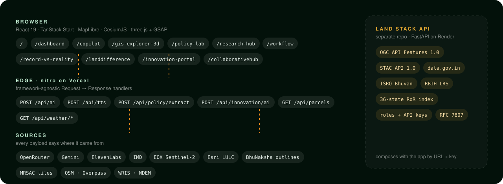

<div align="center">



<br />

**[Live app](https://nirvana-sih.vercel.app)** &nbsp;·&nbsp; **[Land Stack API](https://bhumi-niti-landstack.onrender.com/docs)** &nbsp;·&nbsp; [The idea](#the-idea) &nbsp;·&nbsp; [The method](#the-method) &nbsp;·&nbsp; [The platform](#the-platform) &nbsp;·&nbsp; [Run it](#run-it)

<sub>React 19 · TanStack Start · MapLibre · CesiumJS · three.js + GSAP · OpenRouter · FastAPI · OGC API Features · STAC</sub>

</div>

<br />

<a id="the-idea"></a>

## The idea

Every plot of land in India has two stories. One is written in the record — the 7/12 extract, the mutation register, the cadastral map. The other is on the ground, visible from orbit every five days. **Land disputes live in the distance between the two.**

Bhumi-Niti reads both side by side, finds where they disagree, and turns the fix into evidence a policymaker can defend — in English, हिंदी or मराठी.

The picture above is not an illustration. It is Vadnerbhairav village in Chandwad taluka, Nashik: **every one of its 2,457 official BhuNaksha plot outlines**, coloured by how far each drawn plot drifts from the area written in its 7/12 record.



<sub>A screening signal, not a verdict: roads, channels and pot-kharaba explain part of the gap. Telling which is the platform’s job. Source and method: <code>src/data/cadastral/README.md</code>.</sub>

<br />

<a id="the-method"></a>

## The method



| | Move | What happens | Where |
|---|---|---|---|
| 01 | **Verify** | Each plot gets an integrity score from record-vs-satellite drift, area and owner mismatch, stale mutations and pending cases. High scores go to a field officer. | `/workflow` · `/record-vs-reality` |
| 02 | **Ask** | A question in Hindi, Marathi or English becomes a validated JSON query plan. The model never writes the answer’s numbers — or any SQL. | `/copilot` |
| 03 | **Protect** | The plan travels to state nodes; only aggregates come back, and any cell under five parcels stays home. Asking for owner names is refused by schema. | `/workflow` |
| 04 | **Simulate** | Levers on conversion caps, flood buffers and resurvey coverage — with a distributional lens that shows who loses, and a legal engine that vetoes what the law forbids. | `/policy-lab` · `/landdifference` |
| 05 | **Prove** | The KPI is hash-locked **before** the data is seen, then measured against matched districts. −10 days of before/after becomes −8 days of causal evidence. | `/workflow` |
| 06 | **Capsule** | Data versions, commit, parameters and citations sealed into one re-runnable capsule. | `/workflow` |
| 07 | **Loop** | The capsule lands in the research base and seeds the next question. | `/research-hub` |

<br />

<a id="the-platform"></a>

## The platform

| Route | What it is |
|---|---|
| **`/`** | The story — a scroll-driven 3D dive from India to Maharashtra to the real Vadnerbhairav cadastre (three.js + GSAP ScrollTrigger), then real Sentinel-2 change imagery, the method and the ledger. |
| **`/dashboard`** | The national picture — 43 live IMD stations, climate risk, change timelines. Its sidebar leads to most of the routes below. |
| **`/copilot`** | **Ask Bhumi** — map-first, trilingual NL-GIS copilot. Plans, validates, queries, cites the Act, speaks the answer and moves the map. |
| **`/gis-explorer-3d`** | CesiumJS globe of India with real OSM buildings, four GPU styles, storey counts and an exploded floor stack. |
| **`/policy-lab`** | 14 real instruments — Land Revenue Code, Tenancy Act, MR&TP Act, UDCPR, industrial and logistics policy — read clause by clause (152 citations), with simulated impact. Upload a policy PDF and Gemini extracts its provisions with quotes. |
| **`/research-hub`** | Evidence repository, live collaborative manuscripts, review. |
| **`/workflow`** | The seven moves above as a working, clickable demo. |
| **`/record-vs-reality`** | Field capture: geo-tagged photos, GPS, and a 7/12 cross-check. |
| **`/landdifference`** | Land-use change 2018 → 2024 by state, with scenario levers. |
| **`/innovation-portal`** · **`/collaborativehub`** | Challenges, pilots and grants; shared workspaces. |

### Ask Bhumi, in five steps

1. **Detect** — the language is detected locally (English, हिंदी, मराठी, Hinglish), with no model call.
2. **Plan** — the model is forced to call `plan_query`: intent, place, years, land classes, datasets. It is not allowed to answer yet.
3. **Validate** — the plan is checked against what the platform can actually answer: places resolved, years clamped, follow-ups inherit context (“now compare it with Nashik”).
4. **Query** — data is fetched server-side and tagged `live`, `platform`, `demo`, `document` or `unavailable`. Questions about law are matched against the Policy Lab library and answered only from verbatim clauses, with section and page.
5. **Explain & act** — the model words the answer in the user’s language from those results alone; the server builds the evidence list; the map flies, highlights change or switches layers; the reply is spoken (ElevenLabs, browser voice fallback).

<br />

<a id="the-ledger"></a>

## What’s real, what’s modelled, what’s missing



Every screen carries the same labels. Nothing missing is filled in: an unconnected source says *not connected* and where to verify officially.

<br />

<a id="architecture"></a>

## How it fits together



Two independent deployments. This repository is the app (Vercel). **[`landstack-api`](https://github.com/OmkarKudalkar23/landstack-api)** is a FastAPI gateway (Render) that speaks OGC API Features 1.0 and STAC 1.0 over data.gov.in, ISRO Bhuvan, OpenStreetMap, RBIH Land Record Services and a 36-jurisdiction Record-of-Rights index — with roles, API keys and a provenance envelope on every payload. They compose by URL and key when wired.

<br />

<a id="run-it"></a>

## Run it

```sh
git clone https://github.com/OmkarKudalkar23/bhuniti.git
cd bhuniti
npm install
cp .env.example .env      # add keys — all optional, see below
npm run dev               # → http://localhost:8080
```

Node **20.19+**. Without keys everything still runs; the AI endpoints answer `503` with a reason and the rest of the platform works on bundled and live public data.

| Command | |
|---|---|
| `npm run dev` | Dev server with SSR and `/api/*` |
| `npm run build` · `npm run preview` | Production build (client + SSR + nitro) and local preview |
| `npm run typecheck` · `npm run lint` · `npm run format` | Strict `tsc`, ESLint, Prettier |
| `python scripts/build_landing_parcels.py` | Rebuild the landing page’s 3D cadastre asset |
| `python scripts/readme_assets.py` | Rebuild the animated SVGs in this README |

<details>
<summary><b>Environment variables</b></summary>

<br />

| Variable | Scope | Purpose |
|---|---|---|
| `OPENROUTER_API_KEY` | server | Ask Bhumi (`/api/ai`) and the innovation assistant |
| `OPENROUTER_MODEL` | server | Model for both; default `openai/gpt-4o-mini` |
| `ELEVENLABS_API_KEY` · `ELEVENLABS_VOICE_ID` · `ELEVENLABS_MODEL` | server | Spoken replies (`/api/tts`); browser voice otherwise |
| `GEMINI_API_KEY` · `GEMINI_MODEL` | server | Policy PDF reader (`/api/policy/extract`) |
| `VITE_DEMO_MODE` | client | Prefer the bundled parcel extract (default `true`) |
| `VITE_SENTINEL_YEAR` | client | Sentinel-2 mosaic year (default `2024`) |
| `VITE_PARCEL_API_URL` | client | Optional external parcel service |

`.env` is git-ignored; `.env.example` documents every key.

</details>

<details>
<summary><b>API</b></summary>

<br />

| | Endpoint | |
|---|---|---|
| `POST` | `/api/ai` | Copilot: language → plan → validate → query → explain; returns reply, evidence, chips, map actions, spoken text |
| `POST` | `/api/tts` | ElevenLabs speech (`415` for languages it can’t voice, so the client falls back) |
| `POST` | `/api/policy/extract` | Gemini reads a policy PDF into quoted, cited provisions |
| `POST` | `/api/innovation/ai` | Evidence assistant; citations validated, invented ones dropped |
| `GET` | `/api/parcels?bbox=w,s,e,n` | Cadastral plots for a box; filters `village`, `surveyNumber`, `parcelId` |
| `GET` | `/api/weather/stations` · `/station?id=` · `/summary` | Live IMD weather |

```sh
curl -X POST http://localhost:8080/api/ai -H "content-type: application/json" \
  -d '{"message":"पुणे में जलवायु जोखिम क्या है?"}'
```

The gateway’s own API is documented at [`/docs`](https://bhumi-niti-landstack.onrender.com/docs).

</details>

<details>
<summary><b>Repository map</b></summary>

<br />

```text
src/
  routes/            file routes — / (story), /copilot, /dashboard, /gis-explorer-3d, /policy-lab, …
  components/
    landing/         the story page: three.js cadastre scene, GSAP choreography, method visuals
    home/            Ask Bhumi map + copilot answer cards
    dashboard/  gis3d/  policy-lab/  research-hub/  workflow/  record-reality/  land-difference/  innovation/
  copilot/           language detection, query plan + validation, map actions & chips
  server/            /api handlers — ai-agent, copilot-data, policy-context, parcel-store, tts, policy-extract, weather
  data/
    cadastral/       real Maharashtra plot outlines + provenance README
    policySimulation/ the Policy Lab library (Acts read clause by clause)
public/landing/      compact cadastre for the 3D story (227 KB)
docs/readme/         the animated SVGs on this page
scripts/             importers and asset builders
```

</details>

<details>
<summary><b>Data sources</b></summary>

<br />

| Source | Used for | Status |
|---|---|---|
| Maharashtra land records (BhuNaksha), via the BhuMe bundle | 2,457 plot outlines, Vadnerbhairav | real · prototype use, licence for production pending |
| EOX / Copernicus Sentinel-2 cloudless | imagery 2018–2024 | real |
| Esri / Impact Observatory | 10 m annual land cover | real |
| India Code, Government of Maharashtra | Act and policy text in the Policy Lab | real |
| IMD | 43 live weather stations | real |
| OpenStreetMap (Overpass, Nominatim) | buildings, roads, water, geocoding | real · ODbL |
| MRSAC / Datameet, WRIS, NDEM | cadastral tiles, rivers, historical flood extent | real |
| Land-use scenarios, Policy Lab impact, dashboard KPIs, workflow panels | illustrating the method | modelled — labelled on screen |

Nothing here is an official land record. It does not replace MahaBhumi, Bhu-Naksha, a Tahsildar’s office or a court.

</details>

<details>
<summary><b>Deployment</b></summary>

<br />

- **App → Vercel.** `vercel.json` and `vite.config.ts` select the nitro Vercel preset; `npm run build` emits `.vercel/output/`. Set the server keys above as project secrets.
- **Gateway → Render.** Blueprint from `render.yaml`; `/ready` for health, `/health?probe=false` for fast uptime checks.
- **Lovable.** This repo syncs with its [Lovable project](https://lovable.dev/projects/b07fc0a7-84e0-425d-a58c-6555e94bf0af) — avoid rewriting published history.

</details>

<br />

<div align="center">

<sub><b>BHUMI-NITI · भूमि-नीति</b> — same land, more clarity, better decisions.<br />Built for the Smart India Hackathon.</sub>

</div>
