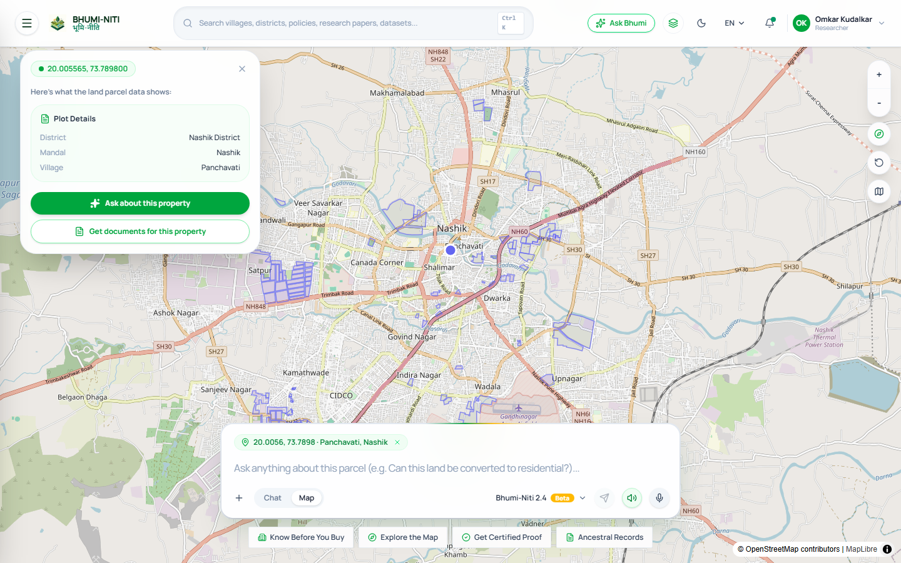
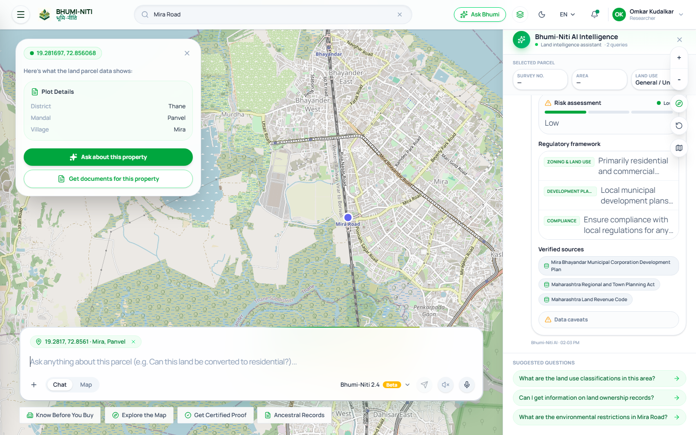
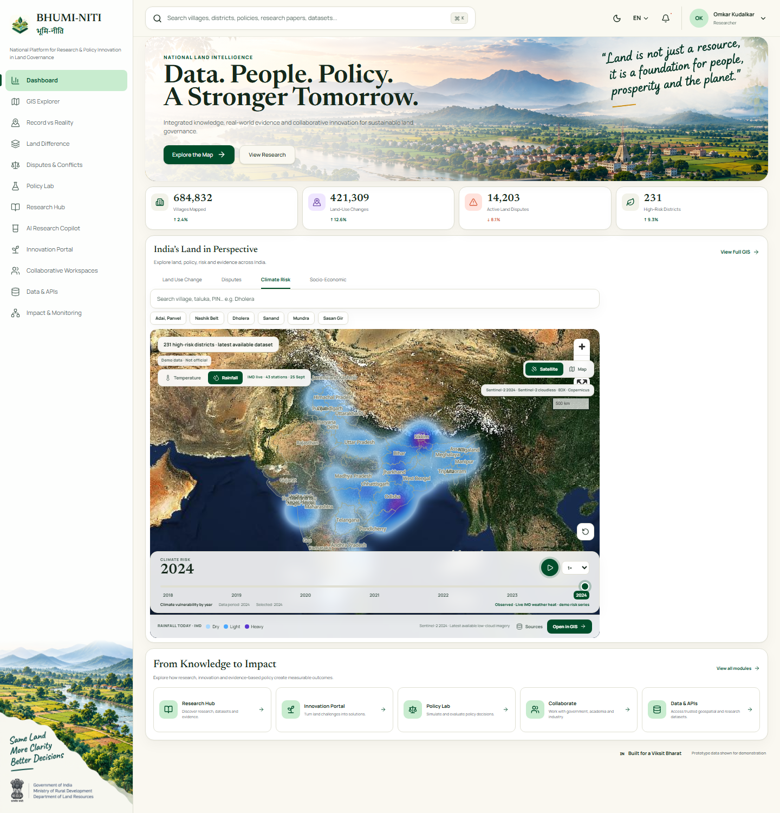
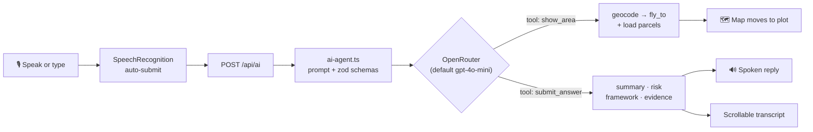
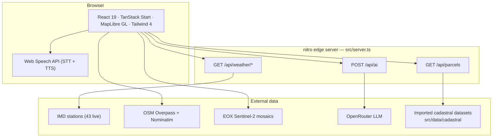

<div align="center">


# भूमि-नीति · BHUMI-NITI

**National Digital Platform for Evidence-Based Land Governance**

*Land · Data · Policy · India — a map-first workspace for cadastral parcels, disputes,
climate risk, research and a **voice-first AI land analyst**.*

<br />


<br />


<br />

**[Overview](#overview)** · **[Features](#features)** · **[Screenshots](#screenshots)** ·
**[Ask Bhumi AI](#ask-bhumi--voice-first-ai-agent)** · **[Quick Start](#quick-start)** ·
**[API](#api-reference)** · **[Architecture](#architecture)**

</div>

---

<a id="overview"></a>
## 🌍 Overview

Bhumi-Niti unifies the land-governance stack into a single research-grade web platform:

- **🗺️ A live parcel map** — click anywhere to reverse-geocode the point and inspect
  survey number, area and land use, backed by a three-tier data pipeline
  (cadastral API → bundled OSM demo extract → live Overpass).
- **🎙️ Ask Bhumi** — speak or type a question; an OpenRouter tool-loop agent answers with
  a structured risk/framework/evidence card, **reads it aloud**, and **flies the map to the
  place you asked about**.
- **🌦️ Live weather intelligence** — IMD station feed (43 stations) with a
  temperature/rainfall heat layer and an animated climate-risk timeline.
- **📊 Six product surfaces** — dashboard, GIS explorer, record-vs-reality,
  land-difference, innovation portal and the AI map home.

Built as a serious prototype for evidence-based land policy — **not** an official record system.

---

<a id="features"></a>
## ✨ Features

<table>
<tr>
<td width="50%">

### 🗣️ Ask Bhumi — voice-first AI
Browser speech-to-text with **auto-submit on silence**, an OpenRouter agent with
`show_area` / `submit_answer` tools, spoken replies via the Web Speech API, and a
scrollable chat transcript that pins to the newest turn.

</td>
<td width="50%">

### 📍 Click-to-inspect parcels
Every map click reverse-geocodes (Nominatim) into District · Mandal · Village cards and
loads plot polygons through API → demo → OSM Overpass with per-attempt timeouts.

</td>
</tr>
<tr>
<td width="50%">

### 🌦️ IMD live weather layer
43 live IMD stations with a **Temperature / Rainfall** toggle, intensity legend, and
live-station status chips rendered over the national map.

</td>
<td width="50%">

### 📈 Climate-risk timeline
Year-scrubbing (2018 → 2024) animation over Sentinel-2 cloudless mosaics with
choropleth risk states, district metrics and before/after land-use comparison.

</td>
</tr>
<tr>
<td width="50%">

### 🧭 GIS Explorer & land tools
Dedicated routes for GIS layers, Record-vs-Reality evidence checks and
Land-Difference (2018 vs 2024) analysis.

</td>
<td width="50%">

### 💡 Innovation Portal
Challenge board for research & policy innovation — hackathons, workspaces and
collaborative programmes for land governance.

</td>
</tr>
</table>

---

<a id="screenshots"></a>
## 📸 Screenshots

<p align="center">
  
  <br />
  <sub><b>Live map home</b> — opens on the Nashik belt; click anywhere for a reverse-geocoded parcel card.</sub>
</p>

<p align="center">
  
  <br />
  <sub><b>Ask Bhumi assistant</b> — scrollable query transcript, risk meter, regulatory framework, verified sources and follow-up chips.</sub>
</p>

<p align="center">
  
  <br />
  <sub><b>Dashboard · Climate Risk</b> — live IMD rainfall heat layer over Sentinel-2 imagery with the animated risk timeline.</sub>
</p>

---

<a id="ask-bhumi--voice-first-ai-agent"></a>
## 🗣️ Ask Bhumi — Voice-First AI Agent

The `/` route is a working agent, not a chat widget:

1. **Listen** — `SpeechRecognition` fills the composer live; when the utterance closes
   (silence gap or mic re-tap) the query **submits itself**.
2. **Reason** — `POST /api/ai` runs an OpenRouter tool loop (≤ 3 rounds) with zod-validated
   tool calls and a system prompt grounded in Indian land-policy context.
3. **Act** — the `show_area` tool returns a `fly_to` action: the client geocodes the place,
   animates the map and loads plots. `submit_answer` returns the structured card.
4. **Speak** — the `spoken` field is narrated via `speechSynthesis` (mute toggle in the
   composer; starting the mic barges in and stops playback).



> 🔌 **Extending the agent** — add a tool declaration in `TOOLS` and a branch in
> `runAgentLoop` (`src/server/ai-agent.ts`); the client executes any new action type.
> Perfect seam for dummy policy-lookup tools.

---

<a id="architecture"></a>
## 🏗️ Architecture



**Request flow on the edge:** `src/server.ts` answers `/api/*` first, then falls through to
TanStack Start SSR. Every handler is framework-agnostic `Request → Response`, so the same
code runs on `vite dev` and the Cloudflare Workers build.

---

<a id="tech-stack"></a>
## 🛠 Tech Stack

| Layer | Choices |
|---|---|
| **Framework** | React 19, TanStack Start / Router, React Query 5 |
| **Build & runtime** | Vite 8, nitro (Cloudflare Workers preset), TypeScript 5.8 (strict) |
| **Styling** | Tailwind CSS 4, Radix UI primitives, CVA + tailwind-merge, tw-animate-css |
| **Mapping** | MapLibre GL 6, custom GeoJSON parcel layers, OSM raster/vector styles |
| **Charts & forms** | Recharts, react-hook-form + zod, lucide-react icons |
| **AI & voice** | OpenRouter chat completions, Web Speech API (STT/TTS), zod tool schemas |
| **Quality** | ESLint 9, Prettier, `tsc --noEmit`, headless-Chrome E2E checks |
| **Deployment** | Lovable-connected repo, nitro → Cloudflare Workers |

---

<a id="quick-start"></a>
## 🚀 Quick Start

**Prerequisites** — [Node.js](https://nodejs.org) **20.19+** and npm
([nvm](https://github.com/nvm-sh/nvm#installing-and-updating) works great).

```sh
git clone <this-repository-url>
cd bhuniti
npm install

# Configure secrets (never commit .env — it is git-ignored)
cp .env.example .env
#   → add your OPENROUTER_API_KEY (powers the Ask Bhumi agent)

npm run dev
#   → http://localhost:8080
```

The app runs fully without the AI key — the agent endpoint returns a graceful `503`
and everything else (map, parcels, weather, dashboard) works offline-first in demo mode.

### Scripts

| Command | What it does |
|---|---|
| `npm run dev` | Dev server with SSR + `/api/*` handlers → `http://localhost:8080` |
| `npm run build` | Production build (client + SSR + nitro Cloudflare bundle) |
| `npm run preview` | Preview the production build locally |
| `npm run lint` | ESLint over the whole repo |
| `npm run format` | Prettier write |

---

<a id="environment"></a>
## 🔐 Environment Variables

`.env` is **git-ignored**; `.env.example` documents every key.

| Variable | Scope | Default | Purpose |
|---|---|---|---|
| `OPENROUTER_API_KEY` | Server only | — | Powers `POST /api/ai` (the agent). Read exclusively in `src/server/ai-agent.ts`. |
| `OPENROUTER_MODEL` | Server only | `openai/gpt-4o-mini` | Chat model for the agent loop. |
| `VITE_DEMO_MODE` | Client | `true` | Prefers the bundled real OSM extract (Gujarat corridor); degrades gracefully offline. |
| `VITE_SENTINEL_YEAR` | Client | `2024` | Sentinel-2 mosaic year for the EOX cloudless layer. |
| `VITE_PARCEL_API_URL` | Client | *(own API)* | Optional external PostGIS-backed parcel service. |
| `SENTINEL_CLIENT_ID` / `SECRET` | Server only | — | Reserved for an authenticated Copernicus proxy path. |

> ☁️ **Deployed builds** (Cloudflare Workers) do not read `.env` — bind
> `OPENROUTER_API_KEY` as an environment **secret** on the platform instead.

---

<a id="api-reference"></a>
## 🌐 API Reference

| Method | Endpoint | Description |
|---|---|---|
| `GET` | `/api/parcels?bbox=w,s,e,n` | Cadastral features for a bounding box. Optional filters: `village`, `surveyNumber`, `parcelId`. |
| `GET` | `/api/weather/stations` | All live IMD stations (43) with temperature & rainfall. |
| `GET` | `/api/weather/station?id=…` | Single station reading. |
| `GET` | `/api/weather/summary` | National rainfall summary. |
| `POST` | `/api/ai` | Land-intelligence agent — tool loop, structured reply, spoken text, map actions. |

<details>
<summary><b>POST /api/ai — example</b></summary>

```sh
curl -X POST http://localhost:8080/api/ai \
  -H "Content-Type: application/json" \
  -d '{"message":"Show me the plots in Nashik"}'
```

```json
{
  "ok": true,
  "model": "openai/gpt-4o-mini",
  "reply": {
    "summary": "The map now displays the land plots in Nashik.",
    "framework": ["Zoning & Land Use: …"],
    "riskAssessment": "Low risk …",
    "evidence": [{ "label": "MahaBhumi Records", "type": "Government" }],
    "limitation": "…",
    "suggestedFollowups": ["What are the zoning regulations for this area?"]
  },
  "spoken": "I've zoomed into Nashik to show you the land plots in the area.",
  "actions": [{ "type": "fly_to", "place": "Nashik", "lat": 19.9975, "lon": 73.7898, "zoom": 13 }]
}
```

</details>

---

<a id="project-structure"></a>
## 📁 Project Structure

```text
bhuniti/
├── public/                     # logo, static assets
├── docs/screenshots/           # README imagery
├── src/
│   ├── routes/                 # /  /dashboard  /gis-explorer  /innovation-portal …
│   ├── components/
│   │   ├── home/               # MapFirstHome — live map + Ask Bhumi composer/sidebar
│   │   ├── dashboard/          # IndiaMap, timeline, choropleth, panels
│   │   ├── innovation/  land-difference/  record-reality/
│   ├── server/
│   │   ├── ai-agent.ts         # OpenRouter tool loop (show_area / submit_answer)
│   │   ├── parcel-store.ts     # bbox cadastral API
│   │   └── weather-india.ts    # live IMD weather proxy
│   ├── services/               # parcelService (3-tier pipeline), geocode, weather, sentinel
│   ├── data/                   # imd-stations, demo-parcels, cadastral extracts, fixtures
│   ├── assets/                 # generated imagery
│   └── styles.css              # design tokens & global styles
├── vite.config.ts              # dev server wiring → src/server.ts
├── .env.example                # all supported env keys
└── package.json
```

---

<a id="data-sources"></a>
## 📡 Data Sources & Disclaimers

| Source | Used for | Access |
|---|---|---|
| **IMD** (India Meteorological Dept.) | Live station weather, rainfall heat layer | Server proxy, 43 stations |
| **OpenStreetMap** | Parcel polygons (Overpass), reverse/forward geocoding (Nominatim) | Keyless, rate-limited |
| **EOX / Copernicus** | Sentinel-2 cloudless mosaics (2018 · 2020 · 2024) | Tile service |
| **Bundled cadastral extracts** | Demo parcels (Gujarat corridor, survey-level) | In-repo JSON |

> ⚠️ **Prototype data shown for demonstration.** Nothing here substitutes for official
> MahaBhumi / Bhu-Naksha records, Tahsildar offices or court documents. The AI assistant
> states its evidence and limitations on every answer.

---

<a id="deployment"></a>
## ☁️ Deployment

- **Lovable** — this repository is connected to Lovable; every push to the connected
  branch syncs back to the editor (see [Development](#development-with-lovable)).
- **Cloudflare Workers** — `npm run build` emits a nitro `cloudflare-module` bundle in
  `.output/`. Set `OPENROUTER_API_KEY` as a platform secret before deploying.
- No other backend is required — all `/api/*` handlers run on the edge runtime.

---

<a id="quality"></a>
## ✅ Quality Gates

```sh
npm run lint        # ESLint 9
npm run format      # Prettier
npx tsc --noEmit    # strict TypeScript, zero errors
npm run build       # client + SSR + nitro, must pass
```

Verified end-to-end with headless Chrome: voice auto-submit → agent reply → TTS narration,
transcript auto-scroll, follow-up chips, fly-to geocoding (district-level accuracy) and
zero page errors.

---

<a id="roadmap"></a>
## 🗺️ Roadmap

- 🧩 **Pluggable policy tools** — land-records lookups as additional agent tools
- 🗄️ **PostGIS parcel service** — swap `VITE_PARCEL_API_URL` for production scale
- 🌏 **Multilingual voice** — regional-language STT/TTS for field use
- 🛰️ **Change alerts** — scheduled Sentinel-2 diff over watched parcels

---

<a id="development-with-lovable"></a>
## 🔗 Development with Lovable

This project was built with [Lovable](https://lovable.dev).

Continue developing in the [Lovable editor](https://lovable.dev/projects/b07fc0a7-84e0-425d-a58c-6555e94bf0af).

- **Ship faster** — describe what to build; Lovable handles the code.
- **Stay in sync** — changes made in Lovable are committed straight to this repository.
- **Full ownership** — push to `main` and your changes sync back into Lovable.

---

<div align="center">

**Crafted for land, data & policy in India 🇮🇳**


<sub>👋 **Bhumi-Niti** — same land, more clarity, better decisions.</sub>

</div>
